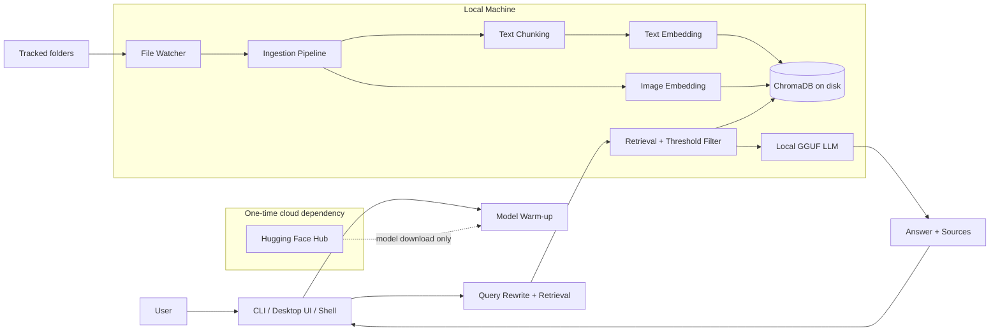

# Cortex Architecture

## Overview
Cortex is a local-first semantic search and question-answering system for personal files. It watches user-selected directories, indexes supported file types into a local ChromaDB instance, retrieves the most relevant chunks or images for a query, and uses a local GGUF LLM to generate the final answer.

The design goal is simple: keep file content, embeddings, retrieval, and generation on the user's machine after the initial model cache step.

## System Diagram

## Model Pipeline

### 1. Model cache and warm-up
At startup, Cortex loads independent runtime resources concurrently:

- ChromaDB client
- SentenceTransformer text embedder (`all-MiniLM-L6-v2`)
- OpenCLIP image model (`ViT-B-32`, `laion2b_s34b_b79k`)
- Local LLM (`Qwen2.5-*` GGUF via `llama-cpp-python`)

The first run may fetch model weights from Hugging Face Hub. After that, the models are expected to come from local cache.

### 2. Ingestion and indexing
When a watched file is created, modified, moved, or deleted, the watcher sends it to the ingestion store.

- Text-like files are read, converted where needed, and chunked.
- Code files use code-aware chunking.
- Images are embedded with OpenCLIP.
- Each file is hashed so Cortex can skip unchanged content.
- Old vectors for the same file are removed before re-adding fresh entries.

### 3. Retrieval
For a query, Cortex:

- embeds the text query with MiniLM for text search
- embeds the query with CLIP for image search
- queries two local Chroma collections: `text_chunks` and `images`
- filters results using calibrated cosine-distance thresholds
- merges and sorts results by score

### 4. Prompt construction and answer generation
The prompt builder combines:

- retrieved file excerpts or image placeholders
- recent conversation history
- the user question

The local LLM then generates the answer. If the retrieved context contains only images and the query looks like a visual lookup rather than a question requiring prose, Cortex can short-circuit with a direct image-only response.

## Data Flow

### Ingestion path
1. The user adds directories to `config.toml` or via the UI/CLI.
2. The watcher observes those directories recursively.
3. New or changed files are passed to the indexing pipeline.
4. Text is chunked, image files are embedded, and both are stored in ChromaDB with file metadata.
5. Deleted or moved files are removed from the vector store and re-indexed as needed.

### Query path
1. The user submits a natural-language query.
2. Cortex optionally rewrites the query into a standalone retrieval query using the local LLM.
3. The rewritten query is embedded for text and image search.
4. Retrieval returns the nearest candidates from local ChromaDB.
5. Distance thresholds remove weak matches before generation.
6. The selected context is inserted into the prompt.
7. The local LLM produces the final answer and sources.

### Startup path
1. Cortex loads cached models concurrently to reduce time-to-ready.
2. The Chroma server is started locally if needed.
3. The watcher performs a bulk scan of tracked folders.
4. Existing files are indexed so the vault is searchable immediately.

## Local / Cloud Components

### Local components
- File watching via `watchdog`
- Chunking and file conversion for text/code documents
- Text embeddings via `sentence-transformers`
- Image embeddings via OpenCLIP
- Vector storage via local ChromaDB
- Answer generation via `llama-cpp-python`
- UI, CLI, shell, and logging

### Cloud components
- Hugging Face Hub is used only for the one-time model download and cache population step.
- No runtime query, file content, or embedding traffic is sent to an external API in normal operation.

## Key Design Decisions

### Local-first by default
All user data stays on the machine. The system is designed so indexing, search, and generation can run offline after setup.

### Separate text and image retrieval
Text and images live in different Chroma collections and use different thresholds. This avoids forcing both modalities through one similarity cutoff that would be too strict for images.

### Threshold filtering before generation
Retrieval is intentionally conservative. Weak matches are dropped before the prompt reaches the LLM so irrelevant context does not contaminate answers.

### File hashing for incremental indexing
Each file is hashed and compared with stored metadata. This prevents repeated re-embedding of unchanged files and keeps background indexing cheaper.

### Concurrent warm-up
Independent resources are loaded in parallel at startup so the app becomes ready sooner, especially when model initialization is the slowest step.

### Local Chroma server process
Chroma is launched as a local subprocess and accessed through localhost. This keeps the vector store simple to deploy while avoiding a separate remote dependency.

### Conversation-aware query rewriting
The visible question can be rewritten into a retrieval-friendly standalone query before embedding. That improves follow-up questions that rely on conversational context.

## Notes and Constraints

- The local vector store is not encrypted at rest.
- Access control is not enforced beyond normal file-system permissions.
- The system currently supports a focused set of file types, with text and image handling implemented separately.
- Retrieval quality depends on the tuned similarity thresholds and the quality of the indexed chunks.

## Summary
Cortex is built as a small local retrieval stack: watch files, normalize and embed them, store vectors locally, retrieve with modality-aware thresholds, and use a local LLM to answer from the retrieved context. The only cloud dependency is initial model caching.
