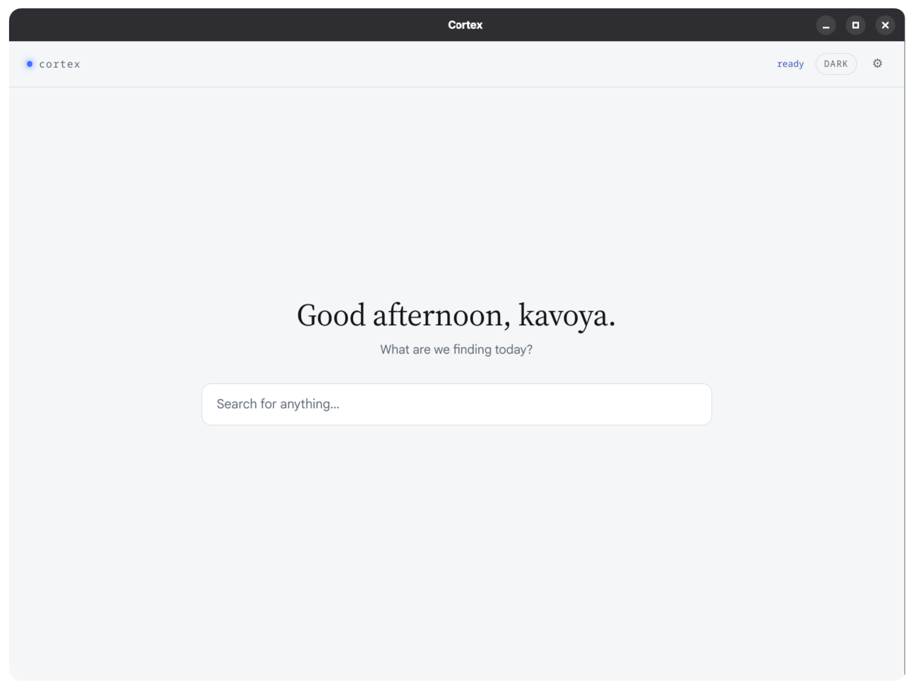
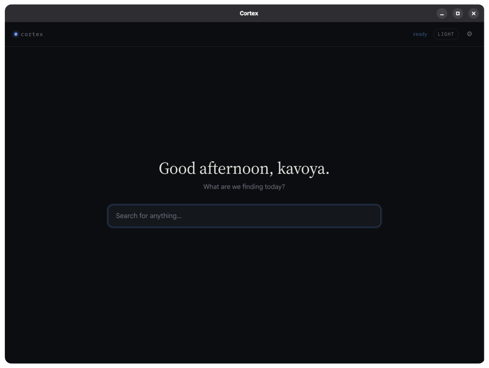
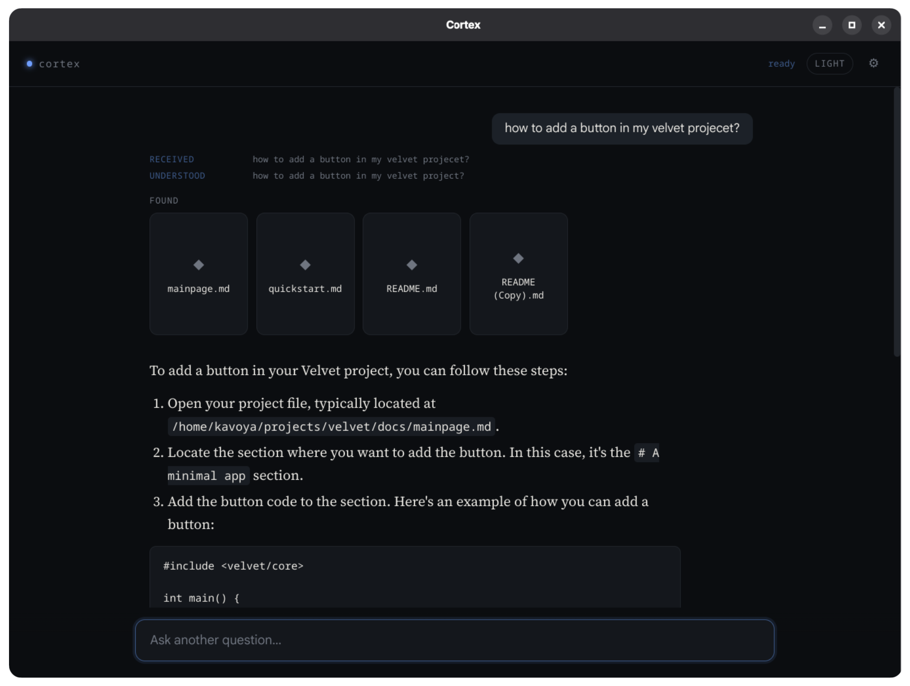
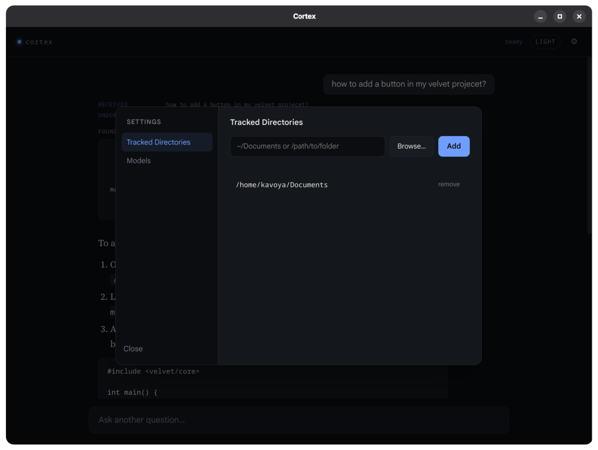
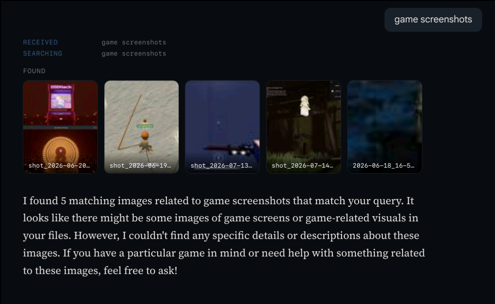
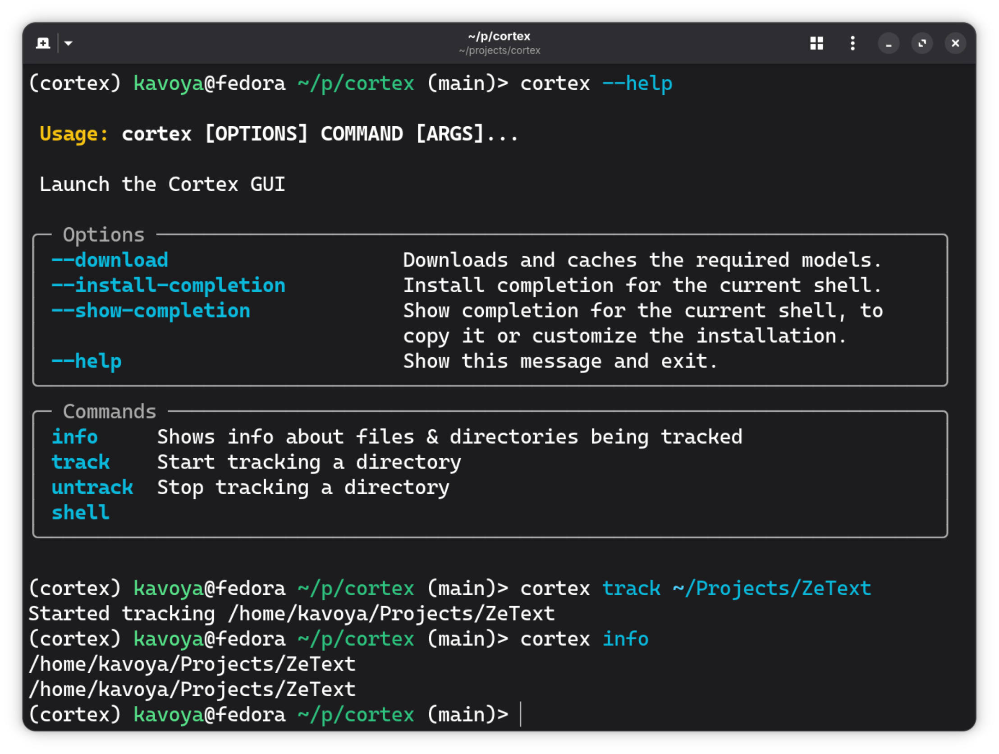

# Cortex

A local-first semantic search and Q&A assistant for your own files. Cortex watches folders you choose, indexes your notes and images, and turns them into something you can actually search by meaning: all powered by models that run entirely on your machine.

## Contents
- [Problem](#problem)
- [Solution](#solution)
- [On-Device AI Usage](#on-device-ai-usage)
- [Local AI Verification](#local-ai-verification)
- [Technical Report](#technical-report)
- [Evaluation](#evaluation)
- [Privacy and Safety](#privacy-and-safety)
- [Tech Stack](#tech-stack)
- [Setup and Usage](#setup-and-usage)
- [Demo and Screenshots](#demo-and-screenshots)
- [Attribution](#attribution)
- [License](#license)
- [Known Limitations and Roadmap](#known-limitations-and-roadmap)

## Problem
Most of what we "know" is scattered across markdown notes, screenshots, and images on our own computers, and it's nearly impossible to search by meaning instead of exact keywords. Existing AI note-taking tools solve this by sending your files to the cloud, which means giving up privacy just to get decent search.


## Solution
Cortex runs a full retrieval-augmented generation (RAG) pipeline locally. It watches tracked directories for your files, embeds their content into a local vector database as they're created or edited, and lets you query that knowledge base in natural language from a simple CLI. Relevant excerpts are retrieved and handed to a local LLM, which answers using only what it found on your system - nothing leaves your machine, and nothing is made up.


## On-Device AI Usage
Everything in Cortex's pipeline runs locally, with no calls to external APIs:
 
- **Text embeddings** — [`all-MiniLM-L6-v2`](https://huggingface.co/sentence-transformers/all-MiniLM-L6-v2) via `sentence-transformers`, used to embed markdown chunks and search queries.
- **Image embeddings** — OpenCLIP `ViT-B-32` (`laion2b_s34b_b79k` weights) via `open_clip_torch`, used to embed images and match them against text queries in the same vector space.
- **Answer generation** — a local GGUF LLM (default: `Qwen2.5-1.5B-Instruct`) served through `llama-cpp-python`. Automatically uses GPU offload when a CUDA device is available, and falls back to CPU otherwise.
- **Vector storage** — a local [ChromaDB](https://www.trychroma.com/) instance, spun up as a subprocess and queried over `localhost`.
- **Relevance filtering** — retrieved results are filtered against a calibrated cosine-distance threshold before ever reaching the LLM, so an unrelated query correctly returns "nothing relevant found" instead of forcing irrelevant sources into the answer. Text (`similarity_threshold = 0.7`) and images (`image_similarity_threshold = 0.75`) use separate thresholds — CLIP's image-text similarity runs lower than text-text similarity even for correct matches (the "modality gap"), so a looser cutoff is needed for images. Both were calibrated empirically against labeled relevant/irrelevant test queries; see `calibrate.py` for the methodology.
The LLM, filename, and repo can be swapped by editing `config.toml`.
 

## Local AI Verification

**Runs fully on-device:**
- Text embedding (MiniLM), image embedding (CLIP), vector search (local ChromaDB instance on `localhost`), and answer generation (local GGUF LLM via `llama-cpp-python`). None of these make network calls once set up.
**Requires internet:**
- Only the one-time `cortex --download` step, which fetches model weights from Hugging Face Hub. After that, Cortex runs fully offline.
**User data leaving the device:**
- None. File contents, embeddings, and query text are never transmitted anywhere. No external API calls happen during indexing, search, or answer generation.


## Technical Report
 
| | |
|---|---|
| Model and runtime | Text: `all-MiniLM-L6-v2` (`sentence-transformers`) · Image: OpenCLIP `ViT-B-32`, `laion2b_s34b_b79k` weights (`open_clip_torch`) · LLM: `Qwen2.5-1.5B-Instruct` GGUF (`llama-cpp-python`) |
| Quantization | LLM uses `q4_k_m` (4-bit) quantization by default; configurable in `config.toml` |
| CPU/GPU/NPU usage | `llama-cpp-python` auto-detects CUDA and offloads to GPU when available (see [Running the model on CUDA](#setup-and-usage)), falls back to CPU otherwise. No NPU support currently. Confirmed via logs: `backend=GPU; requested_gpu_layers=-1` (full GPU offload) on a CUDA-enabled test run. |
| Warm-up latency (one test run, GPU backend) | Total time-to-ready: **4.14s** (see note below) |
| Model size (on disk, GGUF `q4_k_m`) | `all-MiniLM-L6-v2`: ~91 MB · OpenCLIP `ViT-B-32` (`laion2b_s34b_b79k`): ~605 MB · `Qwen2.5-1.5B-Instruct`: ~1.12 GB · `Qwen2.5-3B-Instruct`: ~2.1 GB |
| Per-query latency (warm queries, GPU backend, Device 1) | Retrieval: mean 0.09s, median 0.03s · Generation: mean 0.85s, median 0.87s · End-to-end: mean 0.94s, median 0.90s |
| Per-query latency (warm queries, CPU/integrated-GPU, Device 3) | Retrieval: mean 0.16s, median 0.13s · Generation: mean 5.42s, median 4.51s · End-to-end: mean 5.58s, median 4.64s |
| Peak memory usage (Device 1, discrete GPU) | Process RSS: 2311.9 MiB · GPU memory (this process): 3166.0 MiB |
| Peak memory usage (Device 3, integrated GPU) | Process RSS: 3446.0 MiB · GPU memory: unavailable (no NVIDIA GPU — `nvidia-smi` not present) |
| Tested device specifications | SEE BELOW |

**Devices tested on:**
 
| | Device 1 | Device 2 | Device 3 |
|---|---|---|---|
| Machine | Legion Pro 5 16ARX8 | ASUS VivoBook X515EA | Lenovo Yoga Slim 7i |
| CPU | AMD Ryzen 9 7945HX (32 threads) @ 5.46 GHz | Intel Core i5-1135G7, 11th Gen (8 threads) @ 4.20 GHz | Intel Core Ultra 5 125H (18 threads) @ 4.50 GHz |
| GPU | NVIDIA RTX 4060 Max-Q (discrete) + AMD Radeon 610M (integrated) | Intel Iris Xe (integrated) | Intel Arc Graphics (integrated) |
| RAM | 16 GiB | 8 GiB | 16 GiB |
| OS | Arch Linux | Fedora Linux 44 (Cinnamon) | Fedora Linux |
| LLM variant used | Qwen2.5-3B-Instruct | Qwen2.5-1.5B-Instruct | Qwen2.5-1.5B-Instruct |

<br>

**Note**:
> Benchmarked with `benchmark_query.py`, run once each on Device 1 (discrete NVIDIA GPU, 3B model) and Device 3 (integrated GPU only, 1.5B model). Generation is roughly 6x slower on Device 3 with no discrete GPU to offload to, despite running the smaller model — CPU/integrated-GPU inference is clearly the bottleneck. Device 3's GPU memory reads "unavailable" because it has no NVIDIA hardware, not because of a measurement error. Device 2 hasn't been benchmarked yet. Client, embedder, CLIP, and LLM load concurrently on a thread pool at startup, so the per-model "finished in Xs" lines in the raw warm-up log are completion timestamps from a shared start, not isolated per-model durations.

 
<br>

> The 4.14s figure above is total time-to-ready from a single logged run on one team member's CUDA-enabled machine — it's a startup cost, not per-query response time. Client, embedder, CLIP, and LLM load concurrently on a thread pool, so the per-model "finished in Xs" lines in the raw log are completion timestamps from a shared start, not isolated per-model durations. Model size, per-query latency, memory usage, and the actual tested hardware spec still need to be captured and documented.
 


## Evaluation
 
**Benchmark method:** retrieval relevance was evaluated using `calibrate.py`, which runs a labeled set of relevant/partial/irrelevant test queries against the indexed vault and logs the raw cosine-distance score for every result to a CSV for inspection.
 
**Results:** labeled relevant/partial queries clustered under roughly 0.64 cosine distance, while irrelevant queries clustered above roughly 0.70, with a narrow overlap zone right around 0.70. `similarity_threshold` (0.7) and `image_similarity_threshold` (0.75) were chosen based on that gap.
 
**Baseline comparison:** before threshold filtering was added, search always returned the top-`k` nearest results regardless of actual relevance — a query with no relation to anything in the vault would still surface `k` "sources." The current filtering directly addresses that.
 
**Known failure cases:**
- Queries that land near the threshold boundary can be misclassified in either direction (a specific but under-represented topic scoring similarly to a genuinely unrelated query).
- Vaults with highly repetitive or near-duplicate chunk content can crowd out a genuinely relevant result within the fixed top-`k` retrieval pool before filtering is even applied.


## Privacy and Safety
 
**Data handling:** all indexed file content (Markdown, plain text, DOCX, PDF, images) is processed and embedded entirely on the local machine. No file content or query text is transmitted externally during normal operation.
 
**Permissions:** Cortex only reads files inside directories explicitly added via `cortex track <dir>`. It does not scan the filesystem outside tracked directories.
 
**Storage:** embeddings and file metadata (including full file paths) are stored locally in a ChromaDB instance on disk (`chroma_db/`), unencrypted.
 
**Limitations and potential risks:**
- The local vector store is not encrypted at rest — anyone with filesystem access to `chroma_db/` can read indexed file paths and content chunks.
- There is currently no per-user access control on the local database.
- Tracking a directory containing sensitive files means that content is embedded and stored locally (never transmitted), but remains as accessible as the original files to anyone with access to the machine.


## Tech Stack
 
| Category | Tools |
|---|---|
| Language | Python |
| CLI | [Typer](https://typer.tiangolo.com/) |
| File watching | [watchdog](https://pypi.org/project/watchdog/) |
| Vector DB | [ChromaDB](https://www.trychroma.com/) |
| Embeddings (text) | `sentence-transformers` (`all-MiniLM-L6-v2`) |
| Embeddings (image) | `open_clip_torch` (`ViT-B-32`) |
| LLM inference | `llama-cpp-python` (GGUF, Qwen2.5-1.5B-Instruct by default) |
| Config | TOML (`tomlkit`) |
 

## Setup and Usage
```bash
# 1. create and activate a virtual environment
uv venv
source .venv/bin/activate
 
# 2. install dependencies (~5GB) and cortex
uv sync
 
# 3. cache the required models before first run
cortex --download
```
Once set up, you can run Cortex directly:
 
```bash
cortex --help

cortex info              # show tracked directories
cortex track <dir>       # start tracking a directory
cortex untrack <dir>     # stop tracking a directory
 
cortex shell             # launch the interactive shell
cortex                   # launch the super cool GUI
```
 
Inside the shell, type a natural-language question and Cortex will search your indexed files and generate an answer using the local LLM.


### Running the model on CUDA
By complete default, the program may be running on your CPU.
check logs.txt, which whether the CPU or GPU is being used. 
If you have an NVIDIA GPU:

ensure CUDA toolkit and `nvcc` are installed and added to path.

run:
```
CMAKE_ARGS="-DGGML_CUDA=on" \
uv pip install \
  --python .venv/bin/python \
  --reinstall-package llama-cpp-python \
  --no-cache \
  llama-cpp-python
```

compiling `llama-cpp-python` for CUDA. you should see immense performance improvements with the LLM.


## Demo and Screenshots
### Video demo
Video demo can be found at https://drive.google.com/drive/folders/1tF-myXwrX3N-YdjYoxh6IXmD_mLpnrZ4?usp=sharing

### Screenshots
<table>
  <tr>
    <td width="50%" align="center">
      <br>
      <sub><b>Welcome Page - Light mode</b></sub>
    </td>
    <td width="50%" align="center">
      <br>
      <sub><b>Welcome Page - Dark mode</b></sub>
    </td>
  </tr>
  <tr>
    <td width="50%" align="center">
      <br>
      <sub><b>Search results with source citations</b></sub>
    </td>
    <td width="50%" align="center">
      <br>
      <sub><b>Settings Menu</b></sub>
    </td>
  </tr>
  <tr>
    <td width="50%" align="center">
      <br>
      <sub><b>Image search via CLIP embeddings</b></sub>
    </td>
    <td width="50%" align="center">
      <br>
      <sub><b>Cortex CLI</b></sub>
    </td>
  </tr>
</table>


## Attribution
 
**Pretrained models:**
- [`all-MiniLM-L6-v2`](https://huggingface.co/sentence-transformers/all-MiniLM-L6-v2) — sentence-transformers / Hugging Face
- OpenCLIP `ViT-B-32` (`laion2b_s34b_b79k` weights) — [LAION / OpenCLIP project](https://github.com/mlfoundations/open_clip)
- [`Qwen2.5-1.5B-Instruct`](https://huggingface.co/Qwen/Qwen2.5-1.5B-Instruct-GGUF) (GGUF) — Alibaba Qwen team
**Datasets:** LAION-2B (used to pretrain the OpenCLIP weights above; not used directly by this project)
 
**Libraries:** `chromadb`, `sentence-transformers`, `open-clip-torch`, `llama-cpp-python`, `watchdog`, `typer`, `tomlkit`, `halo`, `rich`, `pyqt6`, `pyqt6-webengine`, `pywebview`, `qtpy`, `mammoth`, `pymupdf4llm`, `pillow`
 
**APIs:** none used at runtime — Cortex is fully local after setup. Hugging Face Hub is used only for the one-time `cortex --download` step.
 
**Pre-existing work:** none beyond the open-source libraries and pretrained models listed above.
 

## License
 
[GNU General Public License v3.0 (GPLv3)](LICENSE)


## Known Limitations and Roadmap
### Completed
- Desktop GUI (light and dark mode)
- Source citations
- Image indexing and search (CLIP)
- Relevance threshold filtering (separately tuned for text and image results)
- Bulk re-index of pre-existing files on startup
- `.PDF`, `.DOCX`, and `.TXT` document support
- Code files (`.py` & `.cpp`) support
  
### Known Limitations
- Indexed files and directories stay stored in the vector database even after being deleted
- No way to clean/empty the database through CLI or GUI
- .py and .cpp are the only supported code files
- The interactive shell is unstable and lacks features that the GUI supports


### Planned
- Model selector
- Additional document types
